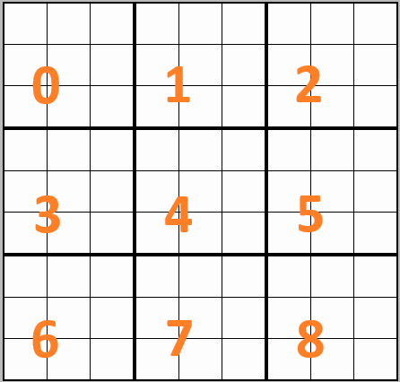

# Azo Sudoku

A library that implements a Sudoku puzzle using the [`com.damelyngdoh.azosudoku.Grid`](src/main/java/com/damelyngdoh/azosudoku/Grid.java) class. The class internally contains implementation of the rules of the game and appropriately throws exception (specified in the [`com.damelyngdoh.azosudoku.exceptions`](src/main/java/com/damelyngdoh/azosudoku/exceptions) package) when attempt is made by an application to break the rules.

Currently, the library supports Sudoku grids with sizes which are perfect squared positive integers, having the number of rows, columns and nonets equal to the size.

## Indexing

Unlike the specification in the external articles below or contrary to natural instinct of ordering, the library implements the indexing system followed by the majority of programming languages, that is, the starting index is 0. The rows are indexed from top to bottom, that is the top most row is the 0th, the next row has index 1 and so on. Similarly, columns are indexed left to right. Nonets are ordered left to right and top to bottom, that is, the top-right most nonet is the 0th nonet, the next nonet in the row is the next index and when the end of the row is reached, the left-most nonet in the next row continues.

Below is a sample nonet indexing convention for a `9 x 9` Sudoku.

## Terminology

Most of the class names represent the different entities in a Sudoku puzzle and for the adept, will be intuitive enough.

### External Resources

Refer to the below articles for general terminilogies and conventions:

- [sudokuprimer.com](https://sudokuprimer.com/glossary.php)
- [sudokudragon.com](https://www.sudokudragon.com/sudoku.htm)
- [sudokuwiki.org](https://www.sudokuwiki.org/glossary)

### Active Verification

This term (within the domain of this project) indicates if the grid, represented by the [Grid](src/main/java/com/damelyngdoh/azosudoku/Grid.java) class performs a validation before setting the value of a cell. This charateristic can be turned on or off using the setter of the `activeVerification` flag (`setActiveVerification` method). By default this characteristic is turned on. Disabling will improve performance as each action of setting a cell's value will not trigger any check on the related cells in the grid at the cost of possibly setting invalid values to the cells. When the flag is off and the `setActiveVerification` method is invoked to turn on (passing `true` as parameter), the `validateGrid` method will be called to perform a complete grid validation before the flag is set to `true`.

### Invalid Empty Cell

An empty cell where there are no possible or permissible values that can be populated. A valid Sudoku puzzle must not contain any invalid empty cell.

### Generator

A generator specified by the interface [`com.damelyngdoh.azosudoku.generators.SudokuGenerator`](src/main/java/com/damelyngdoh/azosudoku/generators/SudokuGenerator.java), as the name suggests, generates a Sudoku puzzle. Some implementation(s) are available such as the [`DiagonalFirstSudokuGenerator`](src/main/java/com/damelyngdoh/azosudoku/generators/DiagonalFirstSudokuGenerator.java) or [`SimpleSudokuGenerator`](src/main/java/com/damelyngdoh/azosudoku/generators/SimpleSudokuGenerator.java) classes in the same package. A generator can generate a completely filled puzzle or a partially filled puzzle depending.

### Solver

A solver specified by the interface [`com.damelyngdoh.azosudoku.solvers.SudokuSolver`](src/main/java/com/damelyngdoh/azosudoku/solvers/SudokuSolver.java) defines the interface for a solving algorithm. Some solver(s) are also available in the package, example is the [`SimpleSudokuSolver`](src/main/java/com/damelyngdoh/azosudoku/solvers/SimpleSudokuSolver.java) class.

You can implement the solver interface if you want to introduce an algorithm for solving a puzzle.

## Utilities

The classes [`com.damelyngdoh.azosudoku.Utils`](src/main/java/com/damelyngdoh/azosudoku/Utils.java) and [`com.damelyngdoh.azosudoku.Validators`](src/main/java/com/damelyngdoh/azosudoku/Validators.java) contains utilities and validators respectively. These utilities are used throughout the library.

## Examples

The package [`com.damelyngdoh.azosudoku.examples`](src/main/java/com/damelyngdoh/azosudoku/examples) contains some sample programs for generating and solving puzzles.
